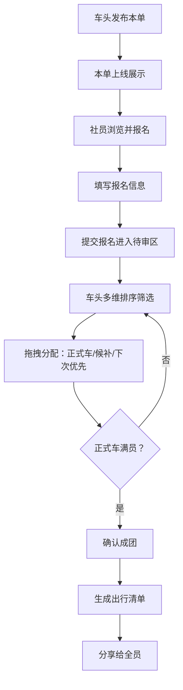

## 1. 产品概述

面向高校剧本杀社团的城限本车队招募 Web 应用，解决社团跨城组织剧本杀活动时信息分散、报名混乱、审核低效的问题。通过本单展示、成员报名、车头审核三个模块联动，实现活动发布→报名→审核→成团→出行清单的全流程数字化管理，降低学生组织外地城限本的沟通成本。

## 2. 核心功能

### 2.1 用户角色

| 角色 | 说明 | 核心权限 |
|------|------|----------|
| 活动负责人（车头） | 发起活动的社团干部或资深社员 | 发布本单、审核报名者、拖拽排班、生成出行清单 |
| 普通社员 | 报名参加活动的学生 | 浏览本单、提交报名信息、查看审核状态 |

### 2.2 功能模块

1. **本单展示模块**：活动卡片列表、活动详情、发布新本单表单
2. **成员报名模块**：报名表单、报名状态展示、个人信息填写
3. **车头审核模块**：报名者列表、多维排序、三栏拖拽（正式车/候补车/下次优先）
4. **出行清单模块**：成团后自动生成含车票、定金、店铺地址、群公告的出行清单

### 2.3 页面详情

| 页面名称 | 模块名称 | 功能描述 |
|----------|----------|----------|
| 本单展示页 | 顶部导航栏 | 品牌 Logo、模块切换标签、用户头像 |
| 本单展示页 | Hero 横幅 | 社团名称、当季热推本、统计数据（本月发车数/参与人数） |
| 本单展示页 | 本单筛选栏 | 按城市/日期/人数/类型筛选 |
| 本单展示页 | 活动卡片网格 | 剧本封面、剧本名、类型标签、发车日期、城市、已报/所需人数、报名按钮 |
| 本单展示页 | 发布本单弹窗 | 剧本信息、校区集合点、去往城市、交通方式、AA 预算、开本店铺、返程时间、请假风险提示 |
| 活动详情页 | 剧本信息区 | 剧本简介、角色配置、难度/时长标签 |
| 活动详情页 | 行程信息区 | 集合点、交通方式、预算明细、时间线、风险提示 |
| 活动详情页 | 报名入口 | 立即报名按钮、已报名列表缩略 |
| 成员报名页 | 基本信息区 | 姓名/昵称、年级、专业、联系方式 |
| 成员报名页 | 出行信息区 | 是否有跨城经验、预算上限、能否担任复盘记录、是否晕车、适合角色偏好 |
| 成员报名页 | 承诺确认 | 不鸽承诺、费用确认按钮 |
| 审核排序页 | 筛选排序栏 | 按年级/熟人关系/是否鸽过/适合角色排序 |
| 审核排序页 | 报名者待审区 | 报名者卡片（含标签、匹配度评分） |
| 审核排序页 | 三栏拖拽区 | 正式车（显示人数上限）、候补车、下次优先 |
| 审核排序页 | 成团操作 | 确认成团按钮、自动生成出行清单 |
| 出行清单页 | 行程概览 | 剧本名、出发/返程日期、城市、全员信息汇总 |
| 出行清单页 | 出行信息卡 | 车票信息占位、定金金额、店铺地址+地图链接、社团群公告 |
| 出行清单页 | 成员列表 | 正式成员名单及分工（车头/记录/财务） |
| 出行清单页 | 导出操作 | 复制分享、打印、生成图片 |

## 3. 核心流程

### 主要用户流程

**活动负责人流程：**
1. 登录进入本单展示页
2. 点击"发布新本单"，填写剧本信息和行程信息后提交
3. 活动上线，等待社员报名
4. 进入审核页面，按维度排序浏览报名者
5. 通过拖拽将报名者分配到正式车/候补车/下次优先
6. 人员确认后点击"确认成团"
7. 系统自动生成出行清单，分享给全员

**普通社员流程：**
1. 浏览本单列表，筛选感兴趣的活动
2. 点击进入活动详情，查看剧本和行程信息
3. 确认可参加后点击"立即报名"
4. 填写个人信息和出行偏好，提交报名
5. 等待车头审核，可查看报名状态
6. 审核通过后查看出行清单并收藏

## 4. 用户界面设计

### 4.1 设计风格

**整体风格定位：悬疑剧本杀主题 × 校园青春感**

- **主色调**：深靛蓝 `#1a1b3a`（悬疑神秘感）× 暖琥珀 `#f59e0b`（青春活力点缀）
- **辅助色**：烟雾紫 `#6366f1` 用于强调按钮，玫瑰红 `#f43f5e` 用于风险提示，翠绿 `#10b981` 用于成功状态
- **背景层次**：深靛蓝主背景 + 微妙噪点纹理 + 紫色光晕渐变叠加
- **按钮风格**：圆润胶囊形，琥珀色主按钮带微发光效果，深靛蓝幽灵按钮
- **字体方案**：标题使用「Noto Serif SC」衬线体（戏剧感），正文使用「Noto Sans SC」无衬线体（可读性）
- **卡片设计**：深色半透明玻璃拟态卡片 `rgba(30,30,60,0.7)`，带模糊边框和微投影
- **图标/emoji 风格**：悬疑主题 emoji（🎭 🔍 🕯️ 🗝️）+ 线性图标，统一圆角描边

### 4.2 页面设计概览

| 页面名称 | 模块名称 | UI 元素 |
|----------|----------|---------|
| 本单展示页 | Hero 横幅 | 左侧大标题衬线体+琥珀色强调，右侧悬浮 3 张本单卡片轮播，背景为剧本杀道具剪影渐变，入场时卡片依次上浮 |
| 本单展示页 | 活动卡片 | 左侧竖排剧本封面图（带悬停放大），右侧深色玻璃卡内含剧本名、4 个类型标签胶囊、日期城市图标行、进度条显示报名进度、琥珀色报名按钮 |
| 本单展示页 | 发布弹窗 | 毛玻璃全屏遮罩，居中白色表单卡片，分 3 步分步指示器（剧本信息→行程信息→确认发布），输入框带浮动标签 |
| 成员报名页 | 报名表单 | 深色背景分左右两栏，左侧行程概要卡（固定），右侧表单项分 4 组（每组带小标题+分割线），标签式单选和滑块选择 |
| 审核排序页 | 三栏拖拽区 | 三列等高深色容器，顶部标题+人数徽标，正式车栏琥珀色边框高亮，拖拽中悬浮项放大+琥珀色发光，放置动画平滑过渡 |
| 审核排序页 | 报名者卡片 | 头像+姓名+年级标签行，下方 4 个小标签（跨城/记录员/不晕车/匹配度%），右侧匹配度圆环进度，悬停展开详细信息 |
| 出行清单页 | 行程概览 | 顶部琥珀色横幅条+剧本名，下方 4 个数据块（出发日/返程日/总预算/人数），背景装饰剧本票根图案 |
| 出行清单页 | 信息卡片 | 4 张并排卡片（车票/定金/店铺/公告），各带不同图标和边框色，悬停时轻微上浮，含快速操作按钮（复制地址/查看地图） |

### 4.3 响应式

- **设计方式**：桌面优先（Desktop-first），适配平板和移动端
- **断点设置**：`xl: 1280px` 桌面，`lg: 1024px` 笔记本，`md: 768px` 平板，`sm: 640px` 手机
- **关键适配**：
  - 审核三栏拖拽区在平板变两栏，手机变垂直堆叠+Tab 切换
  - 活动卡片网格：桌面 3 列 → 平板 2 列 → 手机 1 列
  - 表单多列布局在移动端自动堆叠为单列
- **触摸优化**：移动端拖拽区域增大点击热区，按钮最小高度 44px，滚动流畅无卡顿
