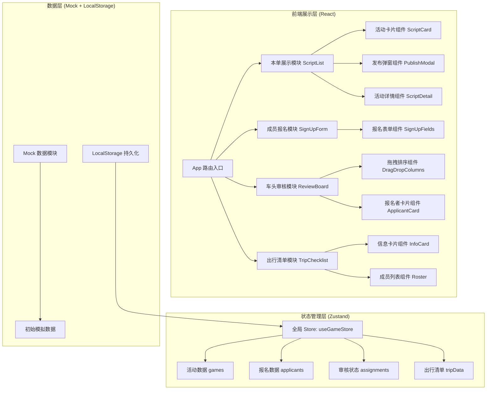

## 1. 架构设计



## 2. 技术说明

- **前端框架**: React@18 + TypeScript（类型安全，便于维护）
- **构建工具**: Vite@5（极速冷启动和热更新）
- **样式方案**: TailwindCSS@3 + TailwindCSS Animate（快速构建 UI + 动画）
- **状态管理**: Zustand（轻量级 Store，API 简洁）
- **拖拽功能**: @dnd-kit/core + @dnd-kit/sortable（高性能拖拽，支持触摸）
- **路由**: React Router DOM@6（SPA 路由管理）
- **图标**: Lucide React（线性图标，风格统一）
- **后端**: 无后端纯前端，使用 Mock 数据 + LocalStorage 持久化
- **数据持久化**: LocalStorage 模拟后端，刷新不丢失数据

## 3. 路由定义

| 路由路径 | 页面组件 | 用途 |
|----------|----------|------|
| `/` | ScriptList | 本单展示首页（活动列表+发布入口） |
| `/script/:id` | ScriptDetail | 活动详情页（含报名入口） |
| `/signup/:id` | SignUpForm | 成员报名表单页 |
| `/review/:id` | ReviewBoard | 车头审核排序页（拖拽三栏） |
| `/checklist/:id` | TripChecklist | 成团后出行清单页 |

## 4. 数据模型定义

```typescript
// 剧本活动
interface GameScript {
  id: string;
  title: string;           // 剧本名
  coverImage: string;      // 封面图
  type: string[];          // 类型标签（如: 硬核/情感/恐怖）
  difficulty: number;      // 难度 1-5
  duration: string;        // 预估时长
  playerCount: number;     // 需要人数
  description: string;     // 剧本简介
  roles: string[];         // 角色列表
  
  // 行程信息
  campus: string;          // 校区集合点
  destinationCity: string; // 去往城市
  transport: string;       // 交通方式（高铁/大巴/自驾）
  budget: number;          // AA 预算（元）
  shopName: string;        // 开本店铺
  shopAddress: string;     // 店铺地址
  departureDate: string;   // 出发日期
  returnTime: string;      // 返程时间
  leaveRiskNotice: string; // 请假风险提示
  deposit: number;         // 定金金额
  
  // 状态
  status: 'recruiting' | 'reviewing' | 'confirmed';
  createdAt: string;
  hostId: string;          // 车头 ID
}

// 报名者
interface Applicant {
  id: string;
  gameId: string;          // 报名的活动 ID
  name: string;            // 姓名/昵称
  grade: string;           // 年级（大一~研三）
  major: string;           // 专业
  phone: string;           // 联系方式
  avatar: string;          // 头像 emoji
  
  // 出行偏好
  hasCrossCityExp: boolean;    // 是否有跨城经验
  budgetLimit: number;         // 预算上限
  canDoReviewRecord: boolean;  // 能否担任复盘记录
  getCarSick: boolean;         // 是否晕车
  preferredRole: string;       // 适合角色偏好
  
  // 审核标签
  acquaintedWithHost: boolean; // 熟人关系（和车头认识）
  hasFlakedBefore: boolean;    // 是否鸽过
  matchScore: number;          // 匹配度评分（0-100，自动计算）
  
  // 当前状态
  status: 'pending' | 'official' | 'standby' | 'next';
  appliedAt: string;
}

// 出行清单
interface TripChecklistData {
  gameId: string;
  trainTickets: string;     // 车次信息占位
  shopAddressWithMap: string;
  groupAnnouncement: string;
  assignedRoles: { name: string; role: string; duty: string }[];
  generatedAt: string;
}
```

## 5. 目录结构

```
src/
├── main.tsx                 # 入口文件
├── App.tsx                  # 路由配置
├── index.css                # 全局样式 + Tailwind
├── store/
│   └── useGameStore.ts      # Zustand 全局状态
├── data/
│   └── mockData.ts          # Mock 初始数据
├── types/
│   └── index.ts             # TypeScript 类型定义
├── utils/
│   ├── storage.ts           # LocalStorage 封装
│   └── matchScore.ts        # 匹配度计算工具
├── components/
│   ├── layout/
│   │   ├── Navbar.tsx       # 顶部导航
│   │   └── PageContainer.tsx
│   ├── script/
│   │   ├── ScriptCard.tsx   # 活动卡片
│   │   ├── ScriptFilter.tsx # 筛选栏
│   │   ├── PublishModal.tsx # 发布弹窗（3步表单）
│   │   └── ScriptDetail.tsx
│   ├── signup/
│   │   ├── SignUpForm.tsx   # 报名主表单
│   │   └── SignUpSuccess.tsx
│   ├── review/
│   │   ├── ReviewBoard.tsx  # 审核主页面
│   │   ├── ApplicantCard.tsx# 报名者卡片
│   │   ├── DragColumn.tsx   # 拖拽列
│   │   └── SortToolbar.tsx  # 排序工具栏
│   └── checklist/
│       ├── TripChecklist.tsx# 出行清单页
│       ├── InfoCard.tsx     # 信息卡片
│       └── ExportBar.tsx    # 导出操作栏
└── pages/
    ├── HomePage.tsx         # 本单展示首页
    ├── DetailPage.tsx       # 活动详情
    ├── SignUpPage.tsx       # 报名页
    ├── ReviewPage.tsx       # 审核页
    └── ChecklistPage.tsx    # 清单页
```
